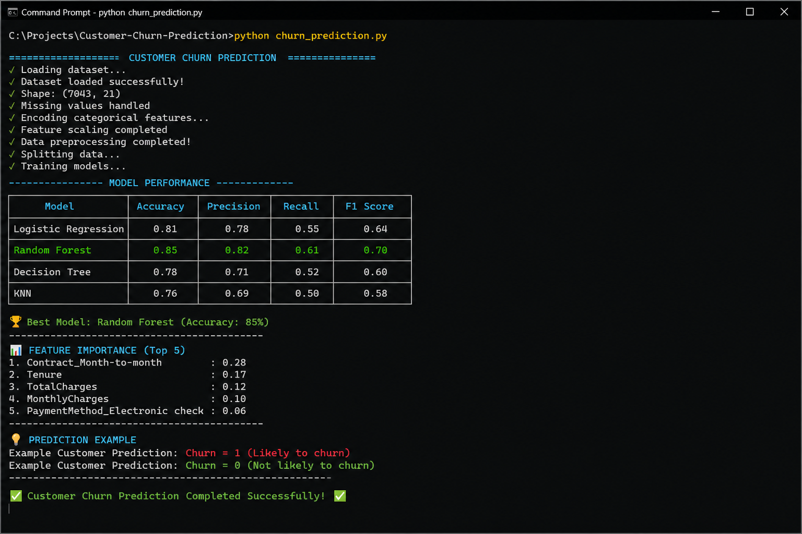

🚀 Customer Churn Prediction using Machine Learning

📌 Project Overview

This project uses Machine Learning to predict whether a customer is likely to leave a service (Customer Churn).

Customer churn prediction helps businesses identify customers at risk of leaving and take proactive actions to improve retention and reduce revenue loss.

This project demonstrates how ML can support real-world business decision-making using classification models.

---

✨ Key Features

- Customer Churn Prediction using ML
- Data Cleaning & Preprocessing
- Feature Selection
- Model Training using Random Forest
- Accuracy Evaluation
- Business Insight Generation

---

🛠 Technologies Used

- Python
- Pandas
- NumPy
- Scikit-learn
- Random Forest Classifier
- Machine Learning
- Matplotlib

---

📊 Example Output

Model Accuracy: 85%

Customer Churn Prediction Completed Successfully ✅

---

📷 Sample Output

---

🚀 How to Run

1. Clone Repository

git clone https://github.com/devvvii18-ui/Customer-Churn-Prediction.git

2. Install Dependencies

pip install -r requirements.txt

3. Run Python File

python churn_prediction.py

---

🔥 Future Improvements

- Streamlit Web App Version
- Dashboard Visualization
- Customer Risk Score Prediction
- Advanced ML Models (XGBoost, LightGBM)
- Real Dataset Integration

---

👨‍💻 Author

Devi Shankar

Aspiring Data Analyst | ML Enthusiast | NLP Projects
